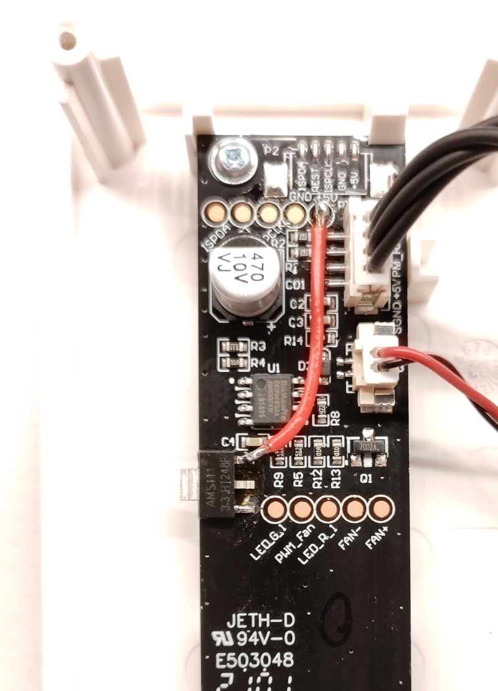

Notes to self about adding an ESP8266 running [Tasmota](https://tasmota.github.io/) to an [IKEA VINDRIKTNING](https://www.ikea.com/nl/en/p/vindriktning-air-quality-sensor-70498242/)

Inspiration:
- https://blakadder.com/vindriktning-tasmota/
- https://github.com/Hypfer/esp8266-vindriktning-particle-sensor
- https://style.oversubstance.net/2021/08/diy-use-an-ikea-vindriktning-air-quality-sensor-in-home-assistant-with-esphome/
- https://github.com/pulsar256/vindriktning_esphome
- https://community.home-assistant.io/t/ikea-vindriktning-air-quality-sensor/324599

Open case. During modification, check if every still fits in case.

Stick double sided tape on metal part of AI-THINKER ESP8266MOD (ESP-12E). Stick onto sticker of fan.

Solder AMS1117-3.3 somewhere on the PCB so that it is not in the way of the fan. Over the `V2.0` marking seems to be a good spot and you can scratch the PCB exposing GND. Use kapton tape to isolate other pins.

Solder wires and components using this schematic: https://arduino-esp8266.readthedocs.io/en/latest/boards.html#improved-stability, but change C1 from 100n to 100uF.

Flash `Release` of `tasmota4M.bin` using [Tasmotizer](https://github.com/tasmota/tasmotizer/releases) and serial connections from: https://www.instructables.com/ESP-12F-ESP8266-Module-Minimal-Breadboard-for-Flas/
This firmware lacks support for the IKEA VINDRIKTNING, but we will add it later using a custom OTA firmware.
Use 2 metal tweezers instead of buttons to connect GPIO0 and reset to GND.

Try [connecting to Tasmota](https://tasmota.github.io/docs/Getting-Started/#initial-configuration) and configuring your WiFi.

Connect D5 (GPIO14) of ESP8266 to REST of sensor PCB with a 1K resistor in series.

You should now have something resembling the photo above. Carefully close the case.

[Compile your own version](https://tasmota.github.io/docs/Compile-your-build/#general-customization-principle) of Tasmota (for example [release v12.2.0](https://github.com/arendst/Tasmota/tree/v12.2.0)) that includes `USE_VINDRIKTNING` (see [user_config_override.h](user_config_override.h)), use the `tasmota4M` target. Flash the resulting binary (`./build_output/firmware/tasmota4M.bin.gz`) onto the ESP8266 using the firmware upgrade [functionality in the web interface](https://tasmota.github.io/docs/Upgrading/#defining-multiple-custom-firmwares).

After update configure `Module type` `Generic (18)` and `D5 GPIO14` to `VINDRIKTNING`.

Done! Go configure options to send the measurements over to some domotica system.

You could go overboard and add more sensors to the same case, the i2c pins are free to use.

